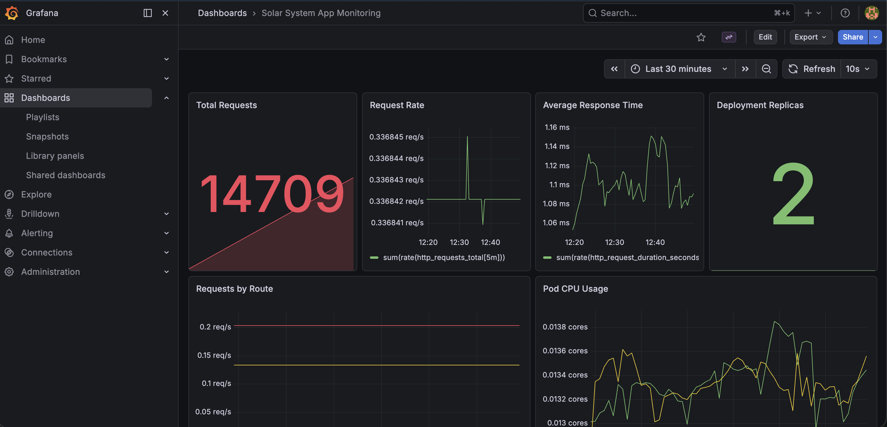
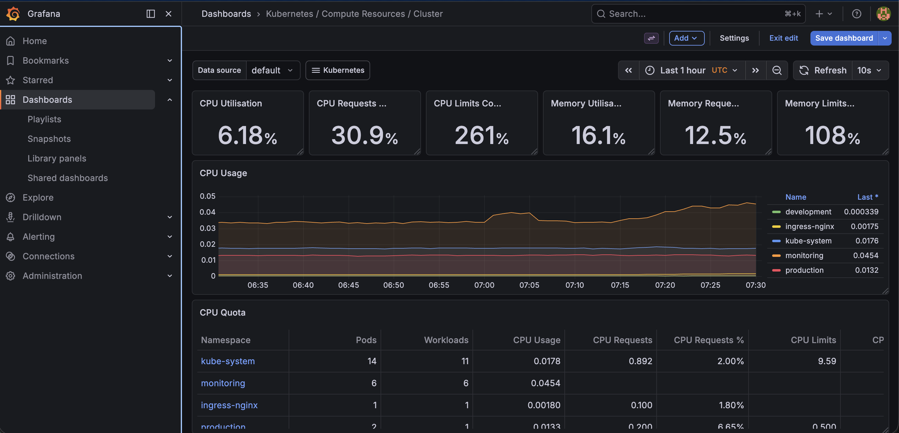

# AKS Cluster Monitoring with Prometheus and Grafana

This project showcases how I instrumented a Node.js application running on Azure Kubernetes Service (AKS) and built an end-to-end monitoring setup using Prometheus and Grafana.

The goal was not just to deploy an app on Kubernetes, but to make it observable at multiple levels:

- application-level monitoring
- pod and deployment monitoring
- node-level monitoring
- cluster-level monitoring

## Project Summary

The application is a Node.js + Express app deployed to AKS. I added Prometheus-compatible metrics to the app, exposed them through `/metrics`, installed a monitoring stack in the cluster, and configured Grafana dashboards to visualize both application and infrastructure health.

This project demonstrates:

- Node.js application instrumentation with `prom-client`
- Kubernetes health checks and resource configuration
- Prometheus scraping through `ServiceMonitor`
- Grafana exposure through NGINX Ingress
- dashboard provisioning through code using a Kubernetes `ConfigMap`

## Dashboard Previews

### Application Monitoring Dashboard

This dashboard focuses on application-level observability for the Node.js service, including request volume, request rate, response time, deployment replicas, and pod resource usage.



### Cluster Monitoring Dashboard

This dashboard highlights AKS and Kubernetes infrastructure visibility, including cluster resource usage, node health, workload behavior, and broader operational trends.



## Architecture

The monitoring flow works like this:

1. The Node.js app exposes application metrics on `/metrics`.
2. The app runs in AKS behind a Kubernetes `Deployment`, `Service`, and `Ingress`.
3. Prometheus scrapes metrics from the app using a `ServiceMonitor`.
4. `node-exporter` collects node-level metrics from AKS worker nodes.
5. `kube-state-metrics` collects Kubernetes object metrics such as deployments, pods, and replica state.
6. Grafana queries Prometheus and displays dashboards for app, node, workload, and cluster visibility.

## What I Implemented

### 1. Application Instrumentation

I updated the Node.js app to expose Prometheus metrics.

Added:

- default Node.js process metrics
- HTTP request count metric
- HTTP request duration metric
- `/metrics` endpoint

Relevant file:

- [app.js](/Users/mdqamarhashmi/Documents/Qamar-Files/Projects/aks-cluster-monitoring/app.js)

Key metrics exposed:

- `http_requests_total`
- `http_request_duration_seconds`
- default Node.js runtime and process metrics from `prom-client`

This made the app observable beyond basic logs and enabled request-rate and latency monitoring in Grafana.

### 2. Kubernetes Workload Configuration

I updated the Kubernetes manifests to make the workload production-friendlier and easier to monitor.

Relevant files:

- [deployment.yaml](/Users/mdqamarhashmi/Documents/Qamar-Files/Projects/aks-cluster-monitoring/kubernetes/deployment.yaml)
- [service.yaml](/Users/mdqamarhashmi/Documents/Qamar-Files/Projects/aks-cluster-monitoring/kubernetes/service.yaml)

Changes included:

- named container and service port as `http`
- readiness probe on `/ready`
- liveness probe
- CPU and memory requests/limits
- stable service endpoint for Prometheus scraping

Why this matters:

- probes improve workload reliability
- resource requests and limits make Kubernetes scheduling and dashboarding more meaningful
- named ports simplify integration with `ServiceMonitor`

### 3. Monitoring Stack Installation

I installed Prometheus and Grafana in a dedicated `monitoring` namespace using `kube-prometheus-stack`.

Core components used:

- Prometheus
- Grafana
- Prometheus Operator
- node-exporter
- kube-state-metrics

Why this stack:

- Prometheus stores and queries metrics
- Grafana visualizes them
- node-exporter provides node-level CPU, memory, disk, and network metrics
- kube-state-metrics provides Kubernetes object state such as deployments, replicas, and pod conditions

### 4. Prometheus Scraping Configuration

I connected Prometheus to the app using a `ServiceMonitor`.

Relevant file:

- [solar-system-servicemonitor.yaml](/Users/mdqamarhashmi/Documents/Qamar-Files/Projects/aks-cluster-monitoring/monitoring/solar-system-servicemonitor.yaml)

This tells Prometheus:

- which Kubernetes `Service` to target
- which namespace the app is running in
- which service port to scrape
- that metrics are available on `/metrics`
- how often metrics should be scraped

This is the key bridge between the application and Prometheus.

### 5. Public Grafana Access Through Ingress

Instead of exposing Grafana with a separate LoadBalancer, I reused the existing NGINX Ingress setup and routed external traffic to Grafana through an Ingress resource.

Relevant file:

- [grafana-ingress.yaml](/Users/mdqamarhashmi/Documents/Qamar-Files/Projects/aks-cluster-monitoring/monitoring/grafana-ingress.yaml)

Why this approach:

- cleaner and more production-like than a standalone public IP
- reuses the existing ingress controller
- makes the monitoring UI easier to share and demonstrate

### 6. Dashboard as Code

To keep dashboard configuration in the repository, I provisioned Grafana dashboards through code instead of only creating them in the Grafana UI.

Relevant files:

- [kube-prometheus-stack-values.yaml](/Users/mdqamarhashmi/Documents/Qamar-Files/Projects/aks-cluster-monitoring/monitoring/kube-prometheus-stack-values.yaml)
- [solar-system-dashboard.json](/Users/mdqamarhashmi/Documents/Qamar-Files/Projects/aks-cluster-monitoring/monitoring/solar-system-dashboard.json)
- [grafana-dashboard-configmap.yaml](/Users/mdqamarhashmi/Documents/Qamar-Files/Projects/aks-cluster-monitoring/monitoring/grafana-dashboard-configmap.yaml)

What this does:

- enables Grafana dashboard sidecar discovery
- stores dashboard JSON in the repo
- loads dashboards into Grafana through a labeled Kubernetes `ConfigMap`

This keeps observability artifacts version-controlled and reproducible.

## Dashboards Covered

The monitoring setup covers four layers of visibility.

### Application Monitoring

Custom dashboard panels include:

- total requests
- request rate
- average response time
- requests by route
- deployment replicas
- pod CPU usage
- pod memory usage

### Workload Monitoring

Using built-in Kubernetes dashboards and Prometheus metrics:

- deployment replica status
- pod CPU and memory usage
- pod restart count
- namespace-level workload usage

### Node Monitoring

Using `node-exporter` metrics:

- node CPU usage
- node memory usage
- host-level infrastructure visibility

### Cluster Monitoring

Using Kubernetes and container metrics:

- cluster CPU usage
- cluster memory usage
- pod count by namespace
- top CPU-consuming pods
- top memory-consuming pods

## Monitoring Files in This Repo

These are the main files a reviewer can inspect to understand the monitoring implementation:

- [app.js](/Users/mdqamarhashmi/Documents/Qamar-Files/Projects/aks-cluster-monitoring/app.js)
- [deployment.yaml](/Users/mdqamarhashmi/Documents/Qamar-Files/Projects/aks-cluster-monitoring/kubernetes/deployment.yaml)
- [service.yaml](/Users/mdqamarhashmi/Documents/Qamar-Files/Projects/aks-cluster-monitoring/kubernetes/service.yaml)
- [solar-system-servicemonitor.yaml](/Users/mdqamarhashmi/Documents/Qamar-Files/Projects/aks-cluster-monitoring/monitoring/solar-system-servicemonitor.yaml)
- [grafana-ingress.yaml](/Users/mdqamarhashmi/Documents/Qamar-Files/Projects/aks-cluster-monitoring/monitoring/grafana-ingress.yaml)
- [kube-prometheus-stack-values.yaml](/Users/mdqamarhashmi/Documents/Qamar-Files/Projects/aks-cluster-monitoring/monitoring/kube-prometheus-stack-values.yaml)
- [grafana-dashboard-configmap.yaml](/Users/mdqamarhashmi/Documents/Qamar-Files/Projects/aks-cluster-monitoring/monitoring/grafana-dashboard-configmap.yaml)
- [solar-system-dashboard.json](/Users/mdqamarhashmi/Documents/Qamar-Files/Projects/aks-cluster-monitoring/monitoring/solar-system-dashboard.json)

## Step-by-Step Implementation Journey

This section explains what I did and why.

### Step 1. Instrumented the application

I added `prom-client` in the Node.js app and exposed `/metrics`.

Why:

- logs tell me what happened
- metrics tell me how the system is behaving over time
- Prometheus needs a metrics endpoint to scrape

### Step 2. Updated Kubernetes manifests

I configured the deployment and service to support better observability.

Why:

- probes show whether the application is alive and ready
- resources make CPU and memory dashboards meaningful
- the named service port is needed by the `ServiceMonitor`

### Step 3. Deployed the app to AKS

I rebuilt the container image, pushed it, and rolled it out to Kubernetes so the running workload included the new `/metrics` endpoint.

Why:

- Kubernetes deploys container images, not local source code
- any app change must be rebuilt into a fresh image before AKS can run it

### Step 4. Installed the monitoring stack

I deployed Prometheus, Grafana, node-exporter, and kube-state-metrics into the cluster.

Why:

- Prometheus is the metrics backend
- Grafana is the visualization layer
- node-exporter gives node-level observability
- kube-state-metrics gives workload and cluster object observability

### Step 5. Connected Prometheus to the app

I created a `ServiceMonitor` so Prometheus could scrape the app’s `/metrics` endpoint.

Why:

- Prometheus does not automatically scrape every application
- a `ServiceMonitor` tells Prometheus exactly what to scrape

### Step 6. Exposed Grafana via NGINX Ingress

I created a Grafana Ingress rather than exposing it through a separate public LoadBalancer.

Why:

- easier to demo
- cleaner architecture
- consistent with the existing app ingress model

### Step 7. Added dashboard provisioning through code

I stored the dashboard JSON in the repo and loaded it through a Kubernetes `ConfigMap`.

Why:

- dashboards should be reproducible
- monitoring configuration should be version-controlled
- this shows observability ownership, not just UI clicking

## How to Reproduce

### 1. Install dependencies

```bash
npm install
```

### 2. Run locally

```bash
export MONGO_URI='your-mongodb-uri'
export MONGO_USERNAME='your-username'
export MONGO_PASSWORD='your-password'
npm start
```

Verify metrics locally:

```bash
curl http://localhost:3000/metrics
```

### 3. Build and push the Docker image

```bash
docker build -t <your-image>:<tag> .
docker push <your-image>:<tag>
```

### 4. Deploy to Kubernetes

Update the image in [deployment.yaml](/Users/mdqamarhashmi/Documents/Qamar-Files/Projects/aks-cluster-monitoring/kubernetes/deployment.yaml), then apply:

```bash
kubectl apply -f kubernetes/deployment.yaml
kubectl apply -f kubernetes/service.yaml
```

### 5. Install the monitoring stack

```bash
helm repo add prometheus-community https://prometheus-community.github.io/helm-charts
helm repo update
kubectl create namespace monitoring
helm install kube-prometheus-stack prometheus-community/kube-prometheus-stack -n monitoring -f monitoring/kube-prometheus-stack-values.yaml
```

### 6. Apply monitoring resources

```bash
kubectl apply -f monitoring/solar-system-servicemonitor.yaml
kubectl apply -f monitoring/grafana-ingress.yaml
kubectl apply -f monitoring/grafana-dashboard-configmap.yaml
```

## Skills Demonstrated

- Node.js observability instrumentation
- Prometheus metrics design
- Kubernetes workload monitoring
- AKS deployment troubleshooting
- Grafana dashboarding
- Infrastructure as Code for monitoring resources
- Ingress-based exposure of internal tooling

## Future Improvements

- add alerting rules for high CPU, memory, and pod restarts
- provision additional cluster dashboards through code
- add screenshots of cluster, node, workload, and app dashboards
- secure Grafana credentials through a secret management workflow

## Recruiter Notes

This project is meant to demonstrate practical cloud-native observability skills, not just container deployment. The implementation covers the full path from application instrumentation to infrastructure visibility and dashboard provisioning. It reflects hands-on work with AKS, Kubernetes networking, Prometheus scraping, and Grafana-based operational monitoring.
